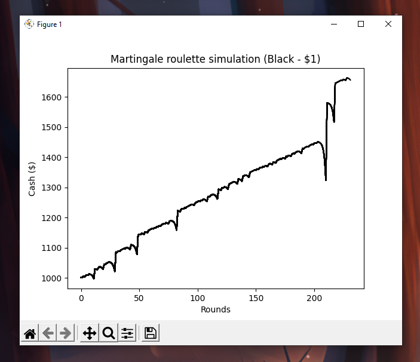

# Martingale-Roulette-Simulation
Simulation of martingale roulette strategy using matplotlib
> Edit config.json with game information before running program. `pip install -r requirements.txt`

Game information is saved to results.txt after completion.

## Example

